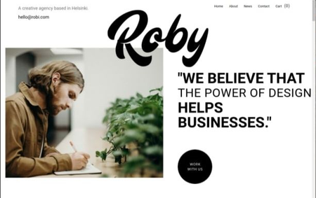

Project Roby
***

Сlick on picture (Link to figma)
   

This is my second job.
The project took 4 days, and  ten cups of coffee.
I will be very happy if you download my project.
Webpack can be used to open Projec Roby in a browser.
